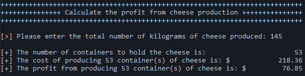

# Description
A simple program that prompts the user to enter the total amount of cheese produced and then calculates the number of containers required to hold the cheese, the cost of the cheese, and the total profit.

